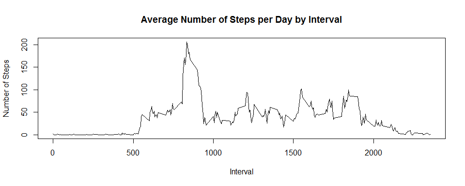
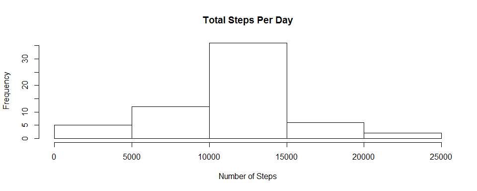
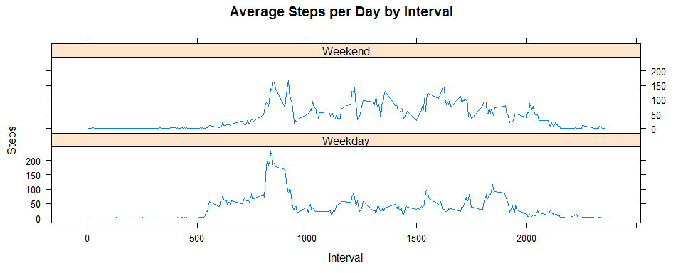

# Reproducible Research: Peer Assessment 1
Matthew Hoops  


```r
knitr::opts_chunk$set(fig.height=4, fig.width=10, scipen=999)
```

## Loading and preprocessing the data
1.1 Check to see if data has been downloaded, if not, download it.


```r
setwd("C:/Users/matth/coursera/reproducible-research/RepData_PeerAssessment1")
file<-"activity.zip"
if(!file.exists(file)){
      url<-"https://d396qusza40orc.cloudfront.net/repdata%2Fdata%2Factivity.zip"
      download.file(url,file)
}
```
1.2 Check if csv file is unzipped, if not, unzip it.

```r
if (!file.exists("activity.csv")) { 
      unzip(file) 
}
```
1.3 Read in csv file and store as dataframe indata. 

```r
indata<-read.csv("activity.csv", header=T, stringsAsFactors=F)
indata$date<- as.Date(indata$date, "%Y-%m-%d")
```


## What is mean total number of steps taken per day?
1. Calculate the total number of steps taken per day.

```r
daily<-aggregate(steps ~ date, indata, sum)
```
2. Make a histogram of the total number of steps taken each day.

```r
with(daily, hist(steps, 
                  main = paste("Total Steps Per Day"), 
                  xlab = "Number of Steps"))
```


3. Calculate and report the mean and median of the total number of steps taken per day.

```r
mymean <- round(with(daily, mean(steps, na.rm = T)), digits=0)
mymedian <- with(daily, median(steps, na.rm = T))      
```
- The mean is: 1.0766\times 10^{4}  
- The median is: 10765

## What is the average daily activity pattern?
1. Make a time series plot (i.e. type = "l") of the 5-minute interval (x-axis) and the average number of steps taken, averaged across all days (y-axis)

```r
byinterval<-aggregate(steps ~ interval, indata, mean)
plot(byinterval$interval,
      byinterval$steps, 
      type="l", 
      xlab="Interval", 
      ylab="Number of Steps",
      main="Average Number of Steps per Day by Interval")
```



2.Which 5-minute interval, on average across all the days in the dataset, contains the maximum number of steps?

```r
mymax<-byinterval[which.max(byinterval$steps),1]
```
- The max interval is: 835

## Imputing missing values
1. Calculate and report the total number of missing values in the dataset (i.e. the total number of rows with NAs)

```r
mymissing<-with(indata,sum(is.na(steps)))
```
- Number of rows with missing values: 2304

2. Devise a strategy for filling in all of the missing values in the dataset. The strategy does not need to be sophisticated. For example, you could use the mean/median for that day, or the mean for that 5-minute interval, etc.
- Use the 5-minute interval averages to impute missing values

3. Create a new dataset that is equal to the original dataset but with the missing data filled in.

```r
imputed <- transform(indata, steps = ifelse(is.na(indata$steps), byinterval$steps[match(indata$interval, byinterval$interval)], indata$steps))
```

4. Make a histogram of the total number of steps taken each day and Calculate and report the mean and median total number of steps taken per day. Do these values differ from the estimates from the first part of the assignment? What is the impact of imputing missing data on the estimates of the total daily number of steps?

```r
byint_imputed<-aggregate(steps ~ date, imputed, sum)

with(byint_imputed, hist(steps, 
                  main = paste("Total Steps Per Day"), 
                  xlab = "Number of Steps"))
```



```r
imp_mean <- round(with(byint_imputed, mean(steps, na.rm = T)), digits=0)
imp_median <- with(byint_imputed, median(steps, na.rm = T))  
diff_totals<-  sum(imputed$steps) -sum(indata$steps, na.rm=T) 
```
- Imputed data mean is: 1.0766\times 10^{4} , which is the same as before: 1.0766\times 10^{4}
- Imputed data median is: 1.0766189\times 10^{4}, which is slightly closer to the mean than without imputation (not imputed was 10765)
- The imputations increased the estimate of total number of steps by: 8.6129509\times 10^{4}


## Are there differences in activity patterns between weekdays and weekends?


```r
weekdays <- c("Monday", "Tuesday", "Wednesday", "Thursday", "Friday")
imputed$dow = as.factor(ifelse(is.element(weekdays(as.Date(imputed$date)),weekdays), "Weekday", "Weekend"))
byint_imputed <- aggregate(steps ~ interval + dow, imputed, mean)
library(lattice)
xyplot(byint_imputed$steps ~ byint_imputed$interval|byint_imputed$dow,                              main="Average Steps per Day by Interval",
        xlab="Interval", 
        ylab="Steps",
        layout=c(1,2), 
        type="l")
```



- Yes,there are some differences in the patterns for weekday and weekend intervals. However, both show more steps during the day and little to none at night, with large spikes in steps early in the day.  Daytime step patterns are also different.  There are larger and more frequent spikes in steps on weekends.
